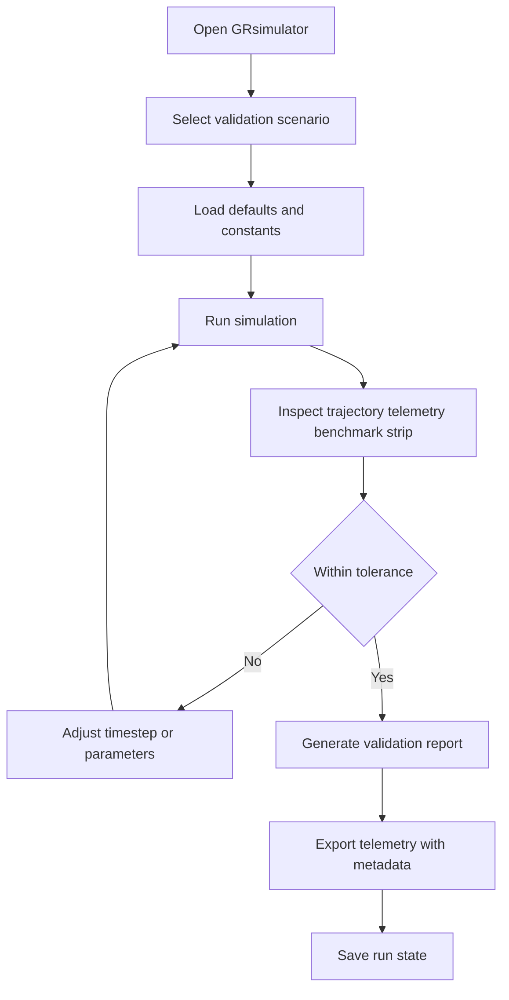
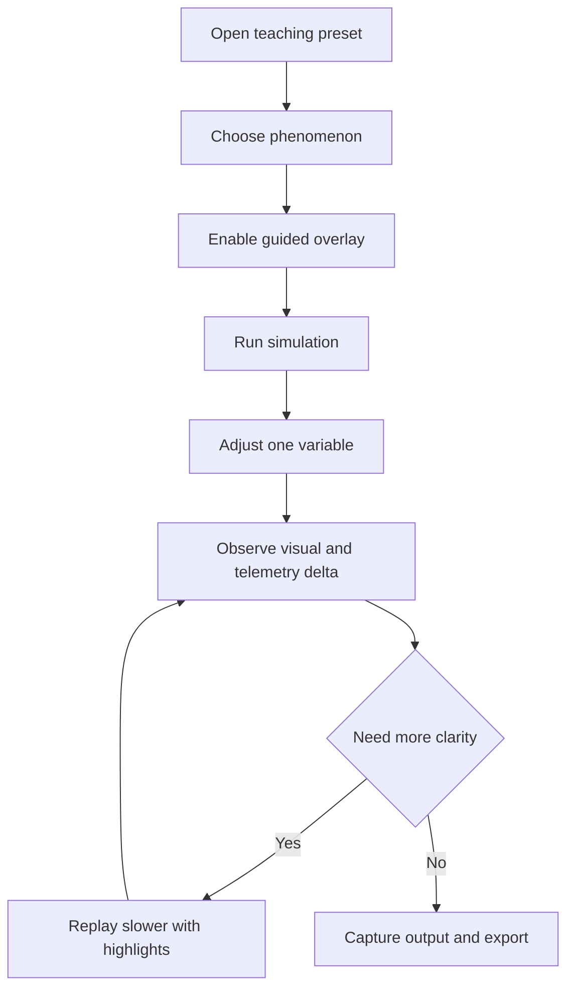
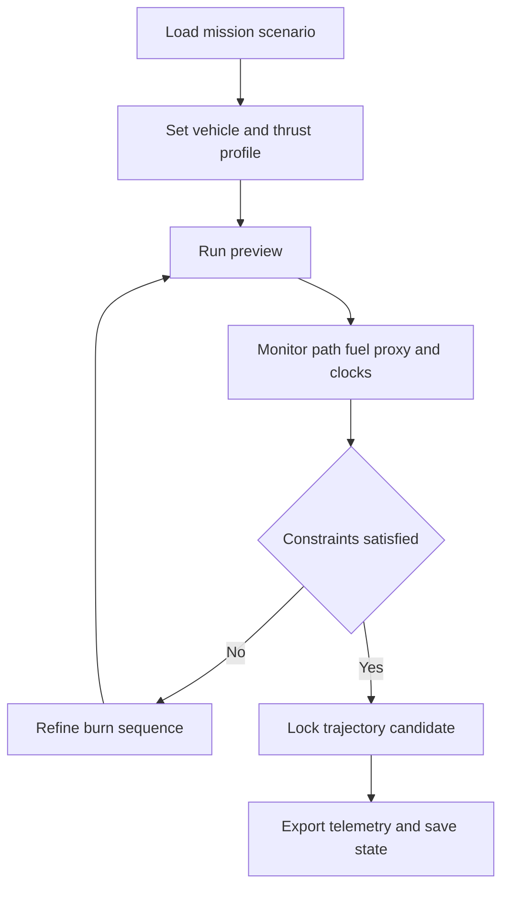

# UX Design Specification GRsimulator

**Author:** Prince Joshi
**Date:** 2026-04-13

---

<!-- UX design content will be appended sequentially through collaborative workflow steps -->

## Executive Summary

### Project Vision

GRsimulator delivers a physics-first simulation environment where orbital behavior emerges from spacetime geometry, making General Relativity observable, testable, and interactive for scientific and educational use. The UX vision is to make highly complex relativistic behavior feel intelligible and controllable without compromising scientific trust.

### Target Users

Primary user groups are researchers validating GR predictions, educators demonstrating relativistic concepts in live sessions, and advanced enthusiasts exploring high-fidelity mission scenarios. All groups need confidence in accuracy, but differ in interface depth needs: researchers prioritize control and export, educators prioritize clarity and narrative visibility, and enthusiasts seek exploratory interaction.

### Key Design Challenges

The interface must expose high-complexity physics controls without overwhelming first-time users. Real-time visualization, telemetry, and parameter editing must stay coherent under performance and precision constraints. The product must balance transparency (how calculations work) with usability (fast path to successful runs and insights).

### Design Opportunities

GRsimulator can differentiate through explainable simulation workflows that connect each visible effect to underlying GR concepts. A dual-mode UX (guided and expert) can serve both classroom and research contexts without fragmenting the product. Scenario-driven starts, live telemetry storytelling, and high-trust validation affordances can create a uniquely credible and approachable relativistic simulation experience.

## Core User Experience

### Defining Experience

The core experience is running, observing, and iterating a relativistic scenario with immediate visual and numerical feedback. The critical interaction to get right is the simulation loop from setup to run to insight, where users adjust parameters and instantly understand the impact on trajectories and time dilation.

### Platform Strategy

Desktop-first is the primary strategy for v1, optimized for mouse and keyboard interaction with scientific workloads and real-time 3D rendering constraints. The UX should support both guided scenario execution for learning and high-control workflows for research users, while preserving headroom for later web-aligned abstractions.

### Effortless Interactions

Loading canonical scenarios, starting simulation runs, camera navigation, telemetry inspection, and result export should feel frictionless and predictable. High-value defaults should reduce setup burden, while progressive disclosure keeps advanced controls available without cluttering first-run experiences.

### Critical Success Moments

The defining success moment is when users see a relativistic effect (such as perihelion precession or clock drift) clearly emerge and can verify it against expected behavior. Trust is won when the interface makes the cause-effect chain obvious from parameter change to numerical output to visual trajectory, and lost if simulation state or telemetry interpretation feels ambiguous.

### Experience Principles

- Physics-first clarity over decorative complexity
- One-click path to meaningful scientific outcomes
- Progressive depth: simple first, powerful when needed
- Observable trust: every key result should be inspectable and exportable

## Desired Emotional Response

### Primary Emotional Goals

Users should feel confident that simulation outputs are scientifically credible, empowered to explore high-complexity relativistic behavior, and accomplished when reproducing known GR effects or extracting valid research data.

### Emotional Journey Mapping

First use should create curiosity with immediate orientation through runnable scenarios. During active simulation, users should feel focused control as parameter changes produce interpretable visual and numerical responses. After successful runs, users should feel validation and momentum, and when errors occur they should feel guided recovery rather than uncertainty.

### Micro-Emotions

The UX should consistently bias toward confidence over confusion, trust over skepticism, and insight over anxiety. Positive micro-moments should include quick setup success, clear validation signals, and satisfying export completion. Negative micro-states to prevent include ambiguous simulator state, opaque solver behavior, and unclear telemetry meaning.

### Design Implications

Core screens should make cause-effect chains visible between inputs, solver updates, and resulting trajectories or clocks. Validation affordances, benchmark overlays, and explicit run metadata should reinforce trust. Progressive disclosure and high-quality defaults should reduce startup friction while preserving expert depth and diagnostic visibility.

### Emotional Design Principles

- Make scientific trust visible at every critical interaction
- Minimize first-run cognitive load without removing depth
- Reward exploration with clear, interpretable feedback
- Design failure states for calm recovery and continued progress

## UX Pattern Analysis & Inspiration

### Inspiring Products Analysis

Blender demonstrates how expert-grade capability can remain usable through structured workspaces, panel hierarchy, and shortcut acceleration. Desmos demonstrates a best-in-class immediate feedback loop where small input changes produce instantly understandable visual outcomes. Kerbal Space Program demonstrates strong scenario-led learning, blending technical depth with approachable experimentation that keeps users engaged.

### Transferable UX Patterns

Adopt a dockable multi-panel workspace combining 3D visualization, simulation controls, and telemetry in one coherent surface. Use scenario-first entry points that enable one-click execution of meaningful reference runs. Preserve continuous visual and numerical feedback during parameter tuning, with clear overlays and history trails that make relativistic effects easy to interpret.

### Anti-Patterns to Avoid

Avoid exposing all advanced controls at first launch, which creates cognitive overload. Avoid opaque system behavior where users cannot infer why results changed after an input modification. Avoid interaction models that bury common actions (run, pause, reset, export) behind deep navigation. Avoid visual flair that competes with scientific legibility or weakens trust.

### Design Inspiration Strategy

Adopt Desmos-style instant feedback for parameter-to-outcome comprehension, Blender-style modular workspace structure for expert throughput, and KSP-style scenario framing for first-run success. Adapt these patterns through progressive disclosure so novice and expert workflows can coexist. Prioritize explainability and reproducibility in every borrowed pattern to fit GRsimulator's research and educational mission.

## Design System Foundation

### 1.1 Design System Choice

A themeable design system approach is selected to combine proven component reliability with project-specific scientific UX identity. This provides a stable base for accessibility, consistency, and development speed while allowing GRsimulator to express a clear "scientific instrumentation" visual language.

### Rationale for Selection

GRsimulator requires fast implementation, strong interaction consistency, and room for high-density expert workflows. A fully custom system would add avoidable upfront cost, while a rigid off-the-shelf style would limit domain fit. A themeable approach best matches the project's need for progressive disclosure, trustworthy data presentation, and long-term extensibility.

### Implementation Approach

Start with core layout and interaction primitives: 3D simulation viewport, control surfaces, telemetry panels, and status/validation feedback. Standardize component states for simulation lifecycle events (running, paused, warning, invalid, exported). Build guided and expert variants from shared primitives so usability differences do not fragment implementation.

### Customization Strategy

Use token-driven theming for typography, color semantics, spacing, and data emphasis to ensure visual consistency. Keep commodity components close to system defaults, and invest custom design effort into domain-critical elements such as telemetry cards, validation indicators, parameter delta views, and proper-time versus coordinate-time comparisons. Document usage rules so new features remain coherent as the product expands.

## 2. Core User Experience

### 2.1 Defining Experience

The defining GRsimulator interaction is configuring or loading a scenario, running the simulation, and iteratively tuning parameters while instantly observing meaningful changes in both 3D behavior and telemetry. When this loop feels clear, responsive, and trustworthy, the rest of the product value follows naturally.

### 2.2 User Mental Model

Users approach the product with a model of set conditions, run physics, inspect outputs, and adjust. Researchers expect reproducibility and explainability, educators expect conceptual clarity for demonstration, and advanced enthusiasts expect fast exploratory control. Many users bring skepticism from existing tools that trade off rigor against usability, so the interface must consistently prove credibility.

### 2.3 Success Criteria

- Fast path to first meaningful run through scenario-first entry
- Immediate, understandable feedback for each parameter change
- Clear simulation-state visibility (running, paused, warning, invalid)
- Built-in benchmark and validation cues to verify correctness
- Trusted export and save workflows for reproducible follow-up analysis

### 2.4 Novel UX Patterns

GRsimulator should combine established patterns (workspace panels, presets, live data overlays) with a distinctive trust-centric interaction pattern: continuous physics explainability. Every major output should be accompanied by clear context such as active assumptions, run metadata, and validation indicators so the product never feels like a black box.

### 2.5 Experience Mechanics

1. **Initiation:** User selects a canonical scenario or prior state, with recommended defaults surfaced up front.
2. **Interaction:** User runs simulation, tunes controls, and navigates the 3D view while telemetry updates in real time.
3. **Feedback:** System provides stability and progress cues, benchmark alignment indicators, and guided error recovery messaging.
4. **Completion:** User confirms target phenomenon or mission result, then exports telemetry and/or saves state for reproducible continuation.

## Visual Design Foundation

### Color System

Adopt a dark-first scientific palette optimized for high data legibility in simulation contexts. Use cool cyan-blue as the primary interactive accent, violet/indigo for secondary emphasis, green for validated states, amber for drift or tolerance warnings, red for invalid states, and structured neutral grays for panel hierarchy and focus management.

### Typography System

Use a clean sans-serif for interface structure and explanatory content, paired with a monospace face for telemetry, solver metadata, and numeric comparisons. Maintain a strict hierarchy for workspace context, panel headings, body guidance, and compact metadata labels so dense information remains scannable.

### Spacing & Layout Foundation

Use an 8px base spacing system with tighter compaction variants for dense telemetry modules. Structure the desktop experience into a persistent multi-panel workspace: primary 3D viewport, simulation controls, telemetry/validation surfaces, and run-status strip. Apply progressive disclosure so guided defaults remain simple while expert controls stay immediately accessible.

### Accessibility Considerations

Maintain AA-level contrast targets for text and critical data overlays. Do not rely on color alone for state communication; pair color with labels, icons, and status text. Ensure keyboard-operable primary controls and visible focus states. Provide consistent units, numeric formatting, and actionable error guidance to reduce cognitive load and support reliable interpretation.

## Design Direction Decision

### Design Directions Explored

Eight design directions were explored to test layout hierarchy, data density, interaction emphasis, and trust signaling across guided and expert contexts. Variations included instrumentation-forward consoles, benchmark-first research views, mission-planner framing, and hybrid progressive-disclosure layouts.

### Chosen Direction

The selected baseline is **D8 - Balanced Hybrid**. It combines a clear default workspace for first-run success with optional high-density expert surfaces. Supporting elements from D3 (guided scenario coaching), D5 (compact expert telemetry), and D7 (benchmark visibility) are incorporated as layered enhancements rather than separate products.

### Design Rationale

This direction best aligns with the mixed audience and the product's trust-first positioning. It preserves conceptual clarity for education, reproducibility and control for research, and responsive exploration for advanced users. The hybrid approach also aligns with the established principles of progressive depth, observability, and explainability.

### Implementation Approach

Implement a shared workspace shell with persistent simulation state visibility, validation strip, and telemetry context. Add guided overlays and quick-start presets for onboarding and classroom workflows. Expose expert compact panels as opt-in density modes. Keep design tokens and interaction rules unified across all modes so evolution does not fragment the experience.

## User Journey Flows

### Researcher Validation Flow

The researcher journey prioritizes reproducibility and benchmark confidence: select a validation scenario, run with trusted defaults, inspect trajectory and telemetry convergence, iterate on parameters when out of tolerance, then export data and save run state with metadata.

### Educator Demonstration Flow

The educator journey optimizes conceptual clarity in live sessions: launch a guided scenario, run with visual annotations, adjust one variable for contrast, replay at slower cadence if needed, and capture outputs for class artifacts.

### Mission Planner Exploration Flow

The mission planner journey emphasizes trade-off evaluation: load mission scenario, configure thrust profile, run preview, monitor path and time-dilation deltas, iterate burns until constraints are met, then lock and export a candidate trajectory.

### Journey Patterns

Common patterns across all flows include scenario-first entry, fast run-observe-adjust loops, persistent simulation status visibility, embedded validation feedback, and save/export as a completion action for trust and continuity.

### Flow Optimization Principles

- Minimize time to first meaningful run
- Keep run, pause, reset, and export always reachable
- Reduce decision friction with progressive disclosure
- Place recovery guidance at the point of failure
- Preserve clear input-to-outcome traceability at every step

## Component Strategy

### Design System Components

Foundation components from the themeable design system should cover shell layout, tabs and drawers, modals, form controls, tables, badges, alerts, tooltips, and standard status indicators. These provide consistent accessibility behavior and reduce implementation variance.

### Custom Components

**Simulation Control Surface**  
Purpose-built control area for lifecycle actions and parameter tuning. Includes states for idle, running, paused, warning, and invalid configurations, with full keyboard operability and explicit status semantics.

**Telemetry Insight Panel**  
Domain-specific panel for high-frequency numeric observability (position, velocity, proper/coordinate time, drift metrics). Supports pinning metrics, focused comparisons, and export subset actions.

**Validation Strip**  
Persistent trust layer that displays benchmark alignment, tolerance health, and solver confidence signals. Uses icon + text + color triplets so meaning is never color-dependent.

**Parameter Delta Inspector**  
Shows changed values and their resulting simulation impact to preserve cause-effect clarity. Supports revert-per-change and save-as-preset behavior for fast iteration.

**Relativistic Clock Comparator**  
Specialized comparison module for proper versus coordinate time across selected objects, with numeric + visual representations and robust unit labeling.

### Component Implementation Strategy

Build all custom components on shared tokens and primitives to preserve coherence across guided and expert modes. Standardize state contracts early (loading, warning, invalid, recovering) and enforce consistent interaction behaviors for run-critical actions.

### Implementation Roadmap

**Phase 1 - Core Flow Components**
- Simulation Control Surface
- Telemetry Insight Panel
- Validation Strip

**Phase 2 - Analysis Depth Components**
- Parameter Delta Inspector
- Relativistic Clock Comparator

**Phase 3 - Enhancement Components**
- Comparative analysis widgets
- Mission-planning overlay modules

## UX Consistency Patterns

### Button Hierarchy

Primary actions are reserved for run-critical or commitment actions (Run, Apply, Export), with one dominant primary per interaction zone. Secondary actions support adjacent tasks (Pause, Reset View, Save Preset), while tertiary actions remain low-emphasis utilities. Destructive actions require distinct styling and explicit confirmation.

### Feedback Patterns

Use concise, contextual success feedback with optional next action links. Warnings should be non-blocking and remediation-focused (for example, tolerance drift guidance). Errors should be actionable and localized to the relevant control or panel. Informational cues should appear inline and avoid interrupting active simulation work.

### Form Patterns

Apply inline validation with unit-aware constraints and recommended default ranges. Use progressive disclosure for advanced physics controls. Preflight checks prevent invalid run states before execution, and correction guidance should be explicit and immediate.

### Navigation Patterns

Maintain persistent workspace regions (viewport, controls, telemetry, status) and stable placement for run lifecycle actions. Guided and expert modes should share the same spatial model to avoid relearning. Scenario, run, and analysis context should always be visible through lightweight breadcrumbs or status labels.

### Additional Patterns

Modal usage should be limited to focused confirmations or high-risk actions; preserve simulation context whenever possible. Empty and loading states should explain current system state and the next recommended action. Search and filtering should support scenarios, saved runs, and telemetry channels with recent and favorite shortcuts.

## Responsive Design & Accessibility

### Responsive Strategy

Desktop-first is the primary strategy for full simulation workflows. Tablet experiences should preserve core control and telemetry flows with reduced density and touch-friendly targets. Mobile should focus on companion capabilities (run status, key telemetry, scenario browsing) rather than full advanced authoring.

### Breakpoint Strategy

- Mobile: 320px to 767px
- Tablet: 768px to 1023px
- Desktop: 1024px and above
- Wide Desktop Enhancement: 1440px and above for expanded parallel analysis panels

Layouts should adapt density and arrangement without changing core interaction semantics.

### Accessibility Strategy

Target WCAG 2.2 AA compliance as the baseline. Ensure robust keyboard operability for run-critical workflows, AA contrast in all themes, and semantic compatibility for assistive technologies. Critical status communication must never rely on color alone and should combine iconography, text, and color cues.

### Testing Strategy

Combine automated accessibility checks with manual validation: keyboard-only navigation, screen reader passes (NVDA and VoiceOver baseline), color-vision simulation, and responsive verification on real devices and major browsers. Include representative users and assistive-technology scenarios in acceptance testing for key flows.

### Implementation Guidelines

Use semantic structure, tokenized spacing/type scales, and relative units for responsive behavior. Maintain visible focus styles, skip-navigation support, and minimum touch target guidance where touch is supported. Standardize numeric and unit formatting for dense telemetry readability. Treat accessibility regressions on core flows as release blockers.
